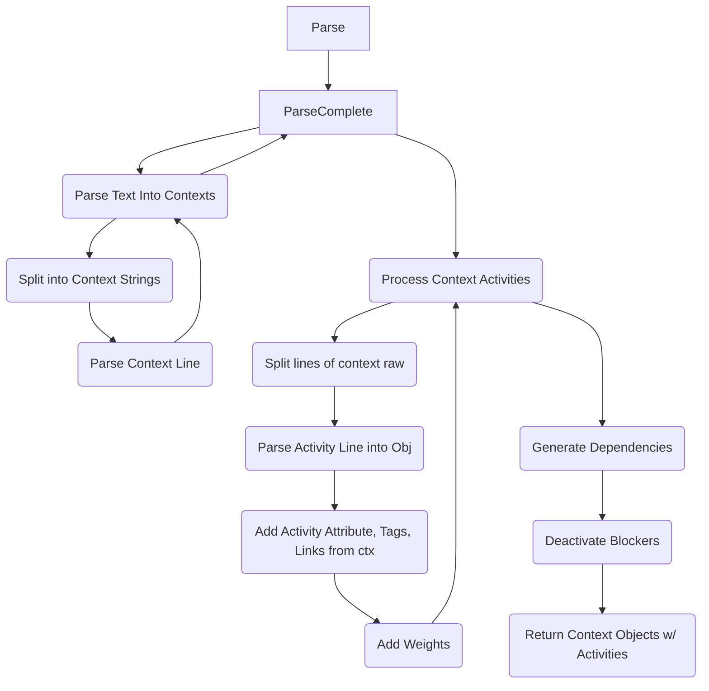

```mermaid
flowchart TD
P[Parse] --> PC[ParseComplete]
PC --> PTIC(Parse Text Into Contexts)
PTIC-->S1(Split into Context Strings)
S1-->P1(Parse Context Line)
P1-->
PTIC --> PC
PC ---> PCA(Process Context Activities)
PCA--> A1(Split lines of context raw)
A1-->A2(Parse Activity Line into Obj)
A2-->A3(Add Activity Attribute, Tags, Links from ctx)
A3-->A4(Add Weights)
A4-->PCA
PCA ---> GD(Generate Dependencies)
GD --> DB(Deactivate Blockers)
DB --> CTXS(Return Context Objects w/ Activities)
```