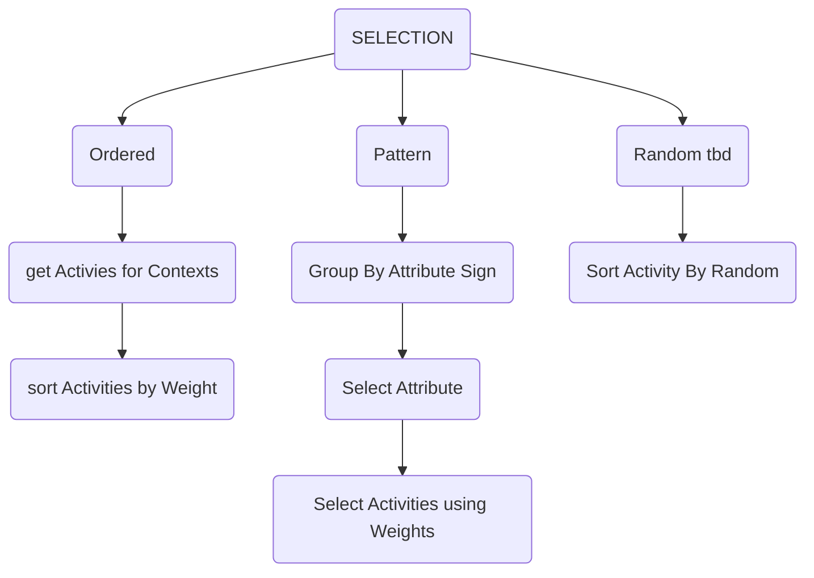

```mermaid
graph TD
S(SELECTION) --> S1(Ordered)
S-->S2(Pattern)
S-->S3(Random tbd)

S1-->A1(get Activies for Contexts)
A1-->A1S(sort Activities by Weight)

S2-->P1(Group By Attribute Sign)-->P2(Select Attribute)
P2-->P3(Select Activities using Weights)


S3-->R1(Sort Activity By Random)

```